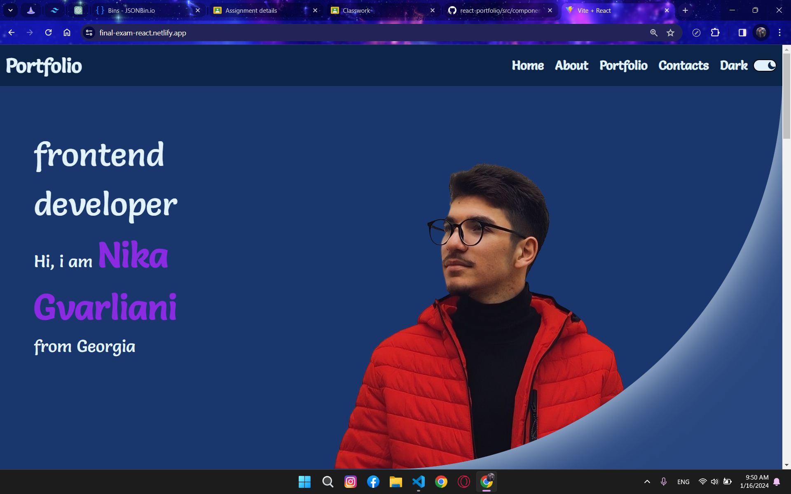
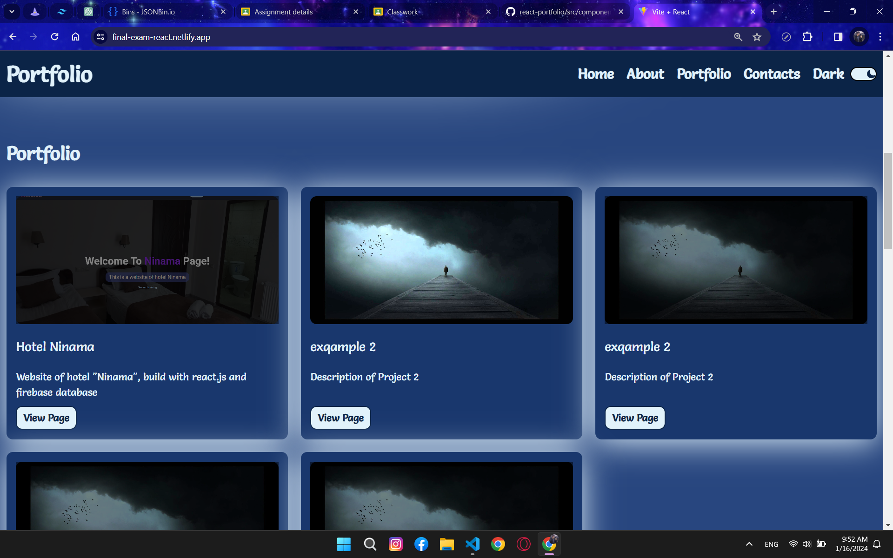
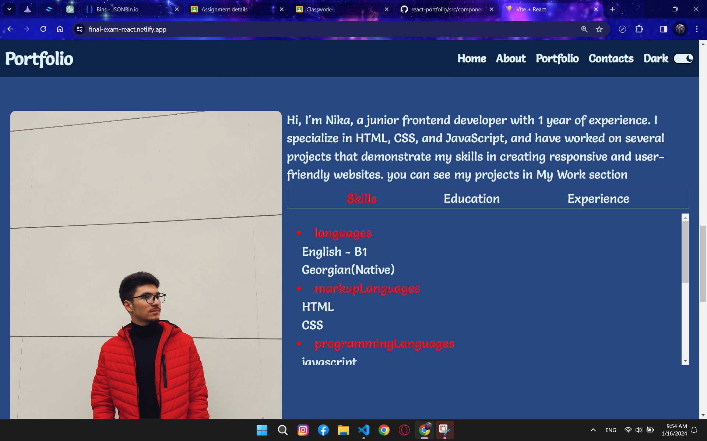
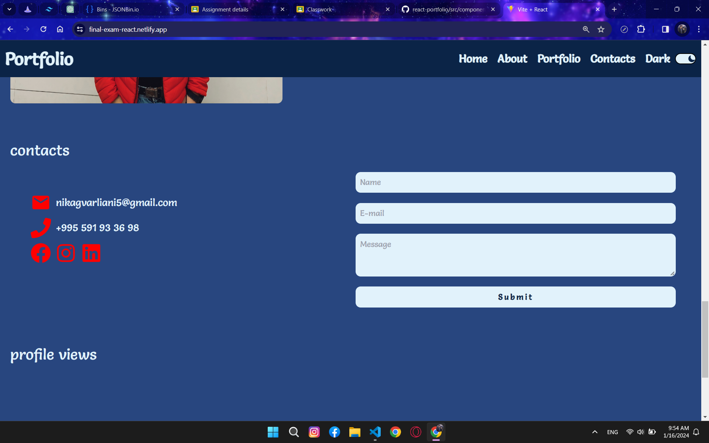

# portfolio website

this is a website made for final exam of react cours in BTU. 
it's a portfolio website of one of the most motivated student Nika gvarliani.

## table of contents

- my name is Nika and i am a student at 'Business and Technology University'. 
  I study on Information technology university and it's my third year in university.
  I am interested in Frontend development and in my plan i gonna be a frontend developer in the future.

## Features

- **Portfolio Section:** A collection of my projects, with a brief descriptions and links. first of the project is a react project and others are only templates yet. Will be added they soon.

- **About Me:** in about section you can see my photo and the information about my education, skills and experience.

- **Contact Form:** A form to get in touch with me.

## Technologies Used

- **React.js:** Used for building the frontend and managing state.

- **CSS (SCSS):** Styling the components for a clean and responsive design.

- **React Router:** Handling navigation within the portfolio.

- **Netlify Forms:** Powering the contact form and handling form submissions.

- **tailwind:** for designing elements.

- **framer motion:** used for making simple animations on website.

- **swiper slider:** it was uset to make feedback page of profile views.

- **axios:** used for getting data from "https://jsonplaceholder.typicode.com/users". only to show that i use this technology.
  this api is only for template.

## Screenshots

*This is the homepage of my portfolio website, featuring a clean design and easy navigation.*

*This is the portfolio page*

*This is the about page.*

*This is the contacts page*

## Installation

1. the project was created with
  - npm crate vite@latest

2. after creating project installd npm
  - npm install
3. to start liveserver
  - npm run dev

- the project is uploaded on netlify.com
    - website link - https://final-exam-react.netlify.app/
    - repository - https://github.com/nika-gva/final-project

- ps. - it's my first readme file :DDD
